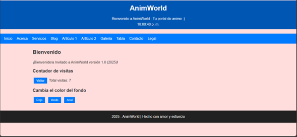
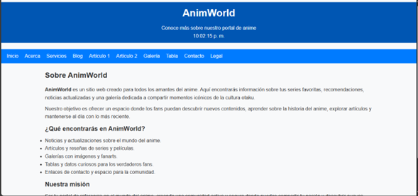
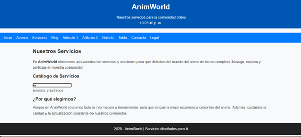
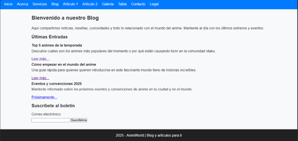

Juan Camilo Uribe Mendoza - 1152326

El sitio web funcionando en la red: 

Estructura de carpetas

/css→ estilos del sitio /js→ java script   /img→ imágenes de la galería /media→ audios y videos- 

- [x] Crear un repositorio público en GitHub llamado exactamente u4-js-sitio.
- [x] Cree una carpeta /jsy un archivo app.jsenlazado en todas las páginas.
- [x] Declarar las constantes APP_NOMBRE, APP_VERSION, ANIO.
- [x] Declarar variables con let: contadorVisitas, usuarioActivo, esMovil.
- [x] Crear funciones sumar()y multiplicar().
- [x] Mostrar mensaje de bienvenida en el elemento con id #salidausando template string.
- [x] Implementar botón con contador de visitas y actualización visual en #totalVisitas.
- [x] Función mostrarHora()que desplegará un reloj actualizado en el encabezado.
- [x] Navegación activa basada en atributo data-pagey clase activo.
- [x] DOM básico: cambiar el color de fondo con botones (rojo, verde, azul).
- [x] DOM avanzado: lista de notas con validación de entrada.
- [x] Validación de formulario en contacto.htmlcon mensajes de error visibles.
- [x] Mostrar mensaje de éxito al enviar formulario válido.
- [x] Buscador en servicios.htmlcon coincidencias en tiempo real.
- [x] Función evaluarNumero(n)de uso condicional if/else.
- [x] Función obtenerDia(numero)usando estructura switch.
- [x] Renderizar perfil acerca.htmlutilizando una cadena de plantilla.
- [x] Guardar y leer contador de visitas con localStorage.
- [x] Crear clase Utilcon método estático formatearMoneda().
- [x] Entregar con un README que incluye instrucciones y capturas de pantalla.

Capturas del proyecto
 Inicio

Acerca

 Servicios

 Blog

 Artículo 1

Galería

 Tabla

 Contacto

 Legal

